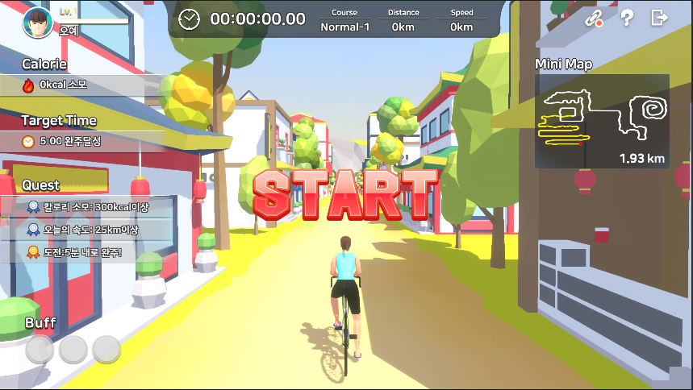

# 🚴‍♀️ 보자마자 피트니스 - 사이클링 투어 (Cycling Tour)
**동작 인식 FIT-TAG 센서 기반 사이클링 피트니스 게임**

* 실내 자전거 + 센서 + Unity로 즐기는 인터랙티브 사이클링 투어  
* Cinemachine 기반 카메라 연출, 미션형 지도 콘텐츠 제공  
* 플레이어의 움직임을 반영해 실제 자전거 여행처럼 몰입 가능한 홈트 환경 구축  
* 첫 여행지는 **아시아!** 소도시를 배경으로 한 힐링 운동 게임 콘텐츠  

| 구분             | 내용                                                                                                                                                                                                                       |
| -------------- | ------------------------------------------------------------------------------------------------------------------------------------------------------------------------------------------------------------------------ |
| **개발 기간 / 역할** | **2022.08 ~ 2023.01 (총 6개월)**<br>팀 프로젝트 (개발인원 3명)<br>맵 구현 · 카메라 연출 · UI/로컬라이징 · 최적화 담당 |
| **기술 스택**      | Unity3D (C#)<br>**Cinemachine** – 카메라 연출<br>**BLE (FIT-TAG 센서)** – 실시간 속도/가속도 반영<br>**Unity UI** – HUD, 랭킹/결과 UI 구현<br>**Localization** – 한국어/영어 지원<br>**MeshBaker** – 메쉬 병합 및 최적화<br>**플랫폼** – Android (Google Play 출시) |
| **주요 기여**      | - 기존 프로젝트 분석 및 버그 수정<br>- 아시아 맵 구현 및 DollyCart 기반 스테이지 연출<br>- Cinemachine Virtual Camera 활용한 카메라 연출<br>- 랭킹 시스템 및 로컬/글로벌 UI 구축<br>- 영어 버전 로컬라이징 및 UI 적용<br>- MeshBaker 활용 성능 최적화<br>- Google Play 빌드 및 QA               |


## 📦 프로젝트 구조 (일부)

```

CYCLING\_TOUR/
├── AsiaMap/                # 게임 진행용 맵 기능 및 카메라 이동
├── Sensor/                 # FIT-TAG 센서 통신 및 캐릭터 연동
├── Lobby/                  # 시작 로비 및 사운드 설정
├── UIManager/              # 각종 UI 뷰 관리
├── GameFinish/             # 종료 후 결과 및 리워드 화면
├── Server/                 # 서버 연동 관련 관리 모듈
├── Scripts/
│   ├── FadeEffect.cs       # 씬 전환용 페이드 효과
│   ├── AspectRatioEnforcer.cs  # 화면 비율 고정
│   └── CSVReader.cs        # 설정용 CSV 데이터 파서

````

| 기능 구분                        | 설명                                                                            |
| ---------------------------- | ----------------------------------------------------------------------------- |
| **Cinemachine 기반 카메라 이동** | - 캐릭터 주행 속도에 따른 카메라 자동 전환<br>- 특정 구간(산악/자갈/모래) 진입 시 시네마틱 연출                   |
| **FIT-TAG 센서 연동**         | - BLE 통신으로 실내 자전거 속도 → 캐릭터 이동 속도에 실시간 반영<br>- 가속/감속, 회전 등 실제 운동 데이터를 직관적으로 전달 |
| **아시아 맵 콘텐츠**             | - 소도시·자연 지형 포함<br>- 체크포인트, 결승선, 보상 아이템 배치                                     |


| 파일명 / 모듈                             | 역할 및 설명                                                                                                          |
| ------------------------------------ | ---------------------------------------------------------------------------------------------------------------- |
| **`L_ESP32BLEApp.cs` – 센서 연동**       | - ESP32 BLE 장치 연결 및 데이터 수신<br>- 가속도(12bytes), Quaternion(16bytes) 데이터 처리<br>- `Man_Move` / `Woman_Move` 스크립트로 전달 |
| **`Man_Move.cs` – 캐릭터 이동**           | - 센서 입력값 기반 가속/감속 구현<br>- 임계값 이상 시 전방 이동 및 애니메이션 실행                                                              |
| **`CM_VCamCtrl.cs` – 카메라 제어**        | - 속도/지형에 따른 가상 카메라 우선순위 전환<br>- Cinemachine Virtual Camera 활용                                                    |
| **`AsiaMap_UIManager.cs` – 맵 상태 관리** | - 산악, 자갈, 모래 등 지형 상태 체크<br>- UI와 연동해 난이도 및 진행 상황 표시                                                              |


## 📸 게임 주요 화면

| 화면               | 설명                                | 이미지                           |
| ---------------- | --------------------------------- | ----------------------------- |
| **타이틀 화면**       | 게임 시작 화면. 로고와 배경 도시 일러스트 연출       |      |
| **로그인 화면**       | 이메일/구글 로그인 지원. 데이터 저장 및 랭킹 연동     |      |
| **로비 화면**        | 캐릭터 및 장비 변경, 스토어/퀘스트 메뉴 진입 가능     |      |
| **튜토리얼 화면 (한글)** | 센서 연동 및 게임 기본 설명 제공               |     |
| **튜토리얼 화면 (영문)** | 게임 진행 방법을 안내하는 영어 버전 튜토리얼         |  |
| **아시아 맵 소개**     | 스테이지 시작 전 지역 설명 페이지               |     |
| **맵 선택 화면**      | 아시아 코스(1\~3) 선택 가능. 난이도(노말/하드) 지원 |     |
| **인게임 - 시작**     | 출발 구간. HUD에 칼로리/목표시간/퀘스트 표시       |     |
| **인게임 - 숲길**     | 다양한 지형(숲/산악) 주행, 카메라 전환 연출        |       |
| **인게임 - 결승선**    | FINISH LINE 이벤트와 기록 저장 출력         |     |
| **보상 화면**        | 코스 완료 후 랜덤 보상(보물상자) 지급            |      |
| **랭킹존**          | 코스별 기록을 기반으로 글로벌 순위 확인 가능         |      |
| **내 정보 - 기본**    | 캐릭터/레벨/칼로리/거리/속도 등 기록 확인          |     |
| **내 정보 - 랭킹**    | 자신의 최고 랭킹 및 기록 확인                 |   |
| **설정 화면**        | 사운드, 알림, 센서 연결 등 시스템 옵션 조정        |      |
| **인게임 - 마을 주행**  | 건물과 마을 배경 구간 주행 화면                |    |
| **인게임 - 결승선(2)** | 다른 코스 결승선 장면                      |    |


## 🌐 Google Play 출시

* [📱 사이클링 투어 (영문 버전)](https://play.google.com/store/apps/details?id=com.gateways.cyclingtour_en&hl=ko&gl=US)

---

## 📺 유튜브 홍보 영상

[](https://www.youtube.com/watch?v=45nUNQHXj1o&t=5s)

```
