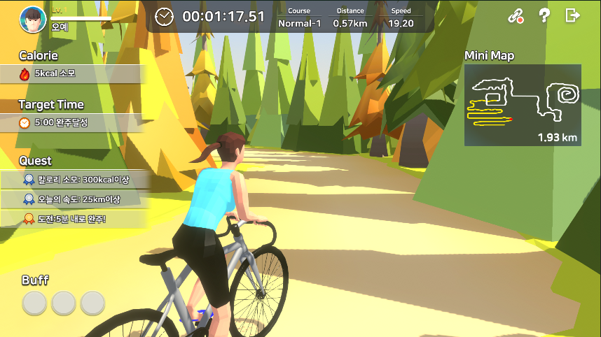

# 🚴‍♀️ 보자마자 피트니스 - 사이클링 투어 (Cycling Tour)
**동작 인식 FIT-TAG 센서 기반 사이클링 피트니스 게임**

* 실내 자전거 + 센서 + Unity로 즐기는 인터랙티브 사이클링 투어
* Cinemachine 기반 카메라 연출, 미션형 지도 콘텐츠 제공
* 플레이어의 움직임을 반영해 실제 자전거 여행처럼 몰입 가능한 홈트 환경 구축
* 첫 여행지는 **아시아!** 소도시를 배경으로 한 힐링 운동 게임 콘텐츠

## 📅 개발 개요

| 구분             | 내용                                                                                                                                                                                 |
| -------------- | ---------------------------------------------------------------------------------------------------------------------------------------------------------------------------------- |
| **개발 기간 / 역할** | **2022.08 \~ 2023.01 (총 6개월)**<br>기획·아트 협업, **개발 100% 담당 (맵/시스템/로컬라이징)**                                                                                                           |
| **기술 스택**      | Unity3D (C#)<br>**Cinemachine** – 카메라 연출<br>**BLE (FIT-TAG 센서)** – 실시간 속도/가속도 반영<br>**Unity UI** – HUD, 랭킹/결과 UI 구현<br>**멀티랭귀지** – 한국어/영어 지원<br>**플랫폼** – Android (Google Play 출시) |
| **주요 기여**      | 센서 연동 모듈 개발<br>아시아 맵 콘텐츠 구현<br>랭킹 시스템 및 로컬/글로벌 UI 구축<br>영문 버전 로컬라이징 및 Google Play 빌드                                                                                               |


## 📦 프로젝트 구조 (일부)

```
CYCLING_TOUR/
├── AsiaMap/                # 게임 진행용 맵 기능 및 카메라 이동
├── Sensor/                 # FIT-TAG 센서 통신 및 캐릭터 연동
├── Lobby/                  # 시작 로비 및 사운드 설정
├── UIManager/              # 각종 UI 뷰 관리
├── GameFinish/             # 종료 후 결과 및 리워드 화면
├── Server/                 # 서버 연동 관련 관리 모듈
├── Scripts/
│   ├── FadeEffect.cs       # 씬 전환용 페이드 효과
│   ├── AspectRatioEnforcer.cs  # 화면 비율 고정
│   └── CSVReader.cs        # 설정용 CSV 데이터 파서
```

## 💡 주요 기능 설명

### 🎥 Cinemachine 기반 카메라 이동

* 캐릭터 주행 속도에 따른 카메라 자동 전환
* 특정 구간(산악/자갈/모래) 진입 시 시네마틱 연출

### 🦵 FIT-TAG 센서 연동

* BLE 통신으로 실내 자전거 속도 → 캐릭터 이동 속도에 실시간 반영
* 가속/감속, 회전 등 실제 운동 데이터를 직관적으로 전달

### 🧭 아시아 맵 콘텐츠

* 소도시·자연 지형 포함
* 체크포인트, 결승선, 보상 아이템 배치

## 📂 주요 소스 코드 설명

### `L_ESP32BLEApp.cs` – 센서 연동

* ESP32 BLE 장치 연결 및 데이터 수신
* 가속도(12bytes), Quaternion(16bytes) 데이터 처리
* `Man_Move` 또는 `Woman_Move` 스크립트로 전달

```csharp
Man_Move.instance.mpu_value[0] = ax;
Man_Move.instance.mpu_value[1] = ay;
```

### `Man_Move.cs` – 캐릭터 이동

* 센서 입력값 기반 가속/감속 구현
* 임계값 이상 시 전방 이동 및 애니메이션 실행

### `CM_VCamCtrl.cs` – 카메라 제어

* 속도/지형에 따른 가상 카메라 우선순위 전환
* Cinemachine Virtual Camera 활용

### `AsiaMap_UIManager.cs` – 맵 상태 관리

* 산악, 자갈, 모래 등 지형 상태 체크
* UI와 연동해 난이도 및 진행 상황 표시

## 📸 게임 주요 화면

| 화면            | 설명                            | 이미지                        |
| ------------- | ----------------------------- | -------------------------- |
| **타이틀 화면**    | 게임 시작 화면. 로고와 배경 도시 일러스트 연출   |   |
| **로그인 화면**    | 이메일/구글 로그인 지원. 데이터 저장 및 랭킹 연동 |   |
| **튜토리얼 화면**   | 센서 연동 및 게임 기본 설명 제공           |  |
| **인게임 - 시작**  | 출발 구간. HUD에 칼로리/목표시간/퀘스트 표시   |  |
| **인게임 - 진행**  | 실시간 속도 반영, 거리/칼로리/속도 데이터 출력   |  |
| **인게임 - 숲길**  | 다양한 지형(숲/산악) 주행, 카메라 전환 연출    |    |
| **인게임 - 결승선** | FINISH LINE 이벤트와 기록 저장 출력     |  |
| **랭킹존**       | 코스별 기록을 기반으로 글로벌 순위 확인 가능     |   |
| **아시아 맵 소개**  | 스테이지 시작 전 지역 설명 페이지           |  |

## 🙋‍♂️ 담당 업무 및 기여도

| 기간         | 기여 내용                               |
| ---------- | ----------------------------------- |
| 2022.08 \~ | BLE 센서 연동 개발, 카메라 연출, 인게임 시스템 구축    |
| 2022.12 \~ | 영문 버전 UI 로컬라이징, Google Play 빌드 및 QA |


## 🌐 Google Play 출시

* [📱 사이클링 투어 (영문 버전)](https://play.google.com/store/apps/details?id=com.gateways.cyclingtour_en&hl=ko&gl=US)

## 📺 유튜브 홍보 영상

[](https://www.youtube.com/watch?v=45nUNQHXj1o&t=5s)
